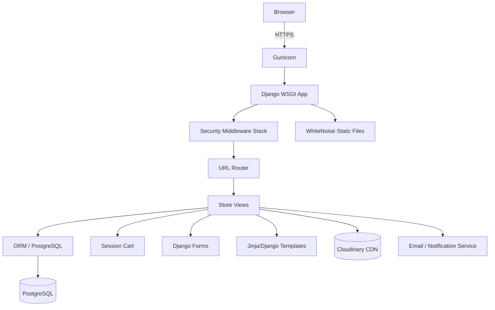
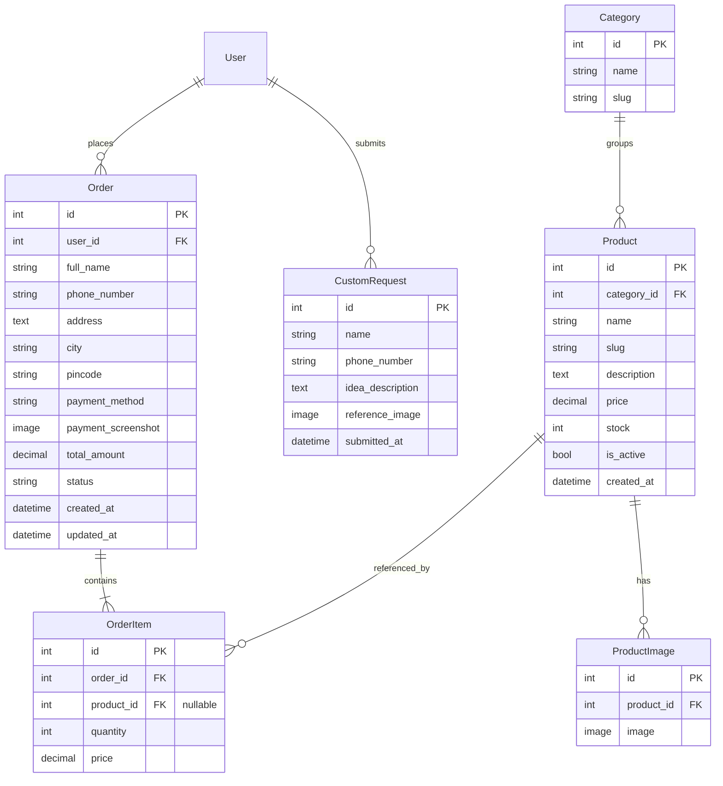

# Design Document: Happy Heavens E-Commerce Redesign

## Overview

Happy Heavens is a Django 4.2 / PostgreSQL monolith serving a handcrafted gifting brand. The redesign hardens the existing codebase rather than replacing it — fixing data model inconsistencies, enforcing inventory integrity, improving the checkout and payment workflow, adding operational admin tooling, and securing the production configuration. The stack remains unchanged: Django 4.2, PostgreSQL, TailwindCSS, Cloudinary, WhiteNoise, and Gunicorn on Render.

The primary goals are:
- Correct data model naming, indexing, and referential integrity
- Atomic inventory management to prevent overselling
- Reliable cart with quantity control and stale-item cleanup
- Validated checkout with QR/COD branching and order confirmation
- Customer-facing order history and admin order management
- Hardened production security configuration
- Elimination of N+1 query patterns on list views

---

## Architecture

The application follows Django's MVT (Model-View-Template) pattern as a single-process monolith. No new services are introduced; instead, existing components are refactored and extended.



### Component Responsibilities

| Component | Responsibility |
|---|---|
| Security_Layer | HTTPS enforcement, ALLOWED_HOSTS, CSRF, X-Frame-Options, secret management |
| Inventory_Manager | Stock validation on add-to-cart and checkout, atomic decrement |
| Payment_Processor | Checkout form validation, QR/COD branching, order creation |
| Cart | Session-based cart with quantity control, stale-item cleanup |
| Search_Engine | Case-insensitive partial match across name, description, category |
| Notification_Service | Email on order status change and custom request submission |
| Media_Pipeline | Cloudinary upload/serve in production, local media in development |
| Admin | Django admin with inline OrderItems, bulk status actions, search/filter |

---

## Components and Interfaces

### Security_Layer

Implemented via `core/settings.py` environment-conditional blocks.

```python
# Production security settings (when DEBUG=False / IS_HEROKU=True)
SECURE_SSL_REDIRECT = True
SECURE_HSTS_SECONDS = 31536000
SESSION_COOKIE_SECURE = True
CSRF_COOKIE_SECURE = True
X_FRAME_OPTIONS = 'DENY'
SECURE_CONTENT_TYPE_NOSNIFF = True
ALLOWED_HOSTS = [env('ALLOWED_HOST')]  # single explicit hostname from env
```

Secrets are loaded exclusively via `django-environ` from `.env` (local) or environment variables (production). The `.env` file is `.gitignore`d.

### Inventory_Manager

Two enforcement points:

1. **Add-to-cart** (`add_to_cart` view): check `product.stock > 0` before calling `cart.add()`.
2. **Checkout** (`checkout_view`): re-validate each cart item's quantity against current `Product.stock` inside a `select_for_update()` transaction before creating the Order.

```python
# Atomic stock decrement pattern
with transaction.atomic():
    for item in cart:
        product = Product.objects.select_for_update().get(pk=item['product'].pk)
        if product.stock < item['quantity']:
            raise InsufficientStockError(product)
        product.stock -= item['quantity']
        product.save(update_fields=['stock'])
```

### Cart

The existing `Cart` class in `store/cart.py` is extended with:
- `update(product, quantity)` — set quantity directly; removes item if quantity ≤ 0
- `__iter__` filters out products where `is_active=False` and flags them for removal notification
- Session TTL already set to 7 days via `SESSION_COOKIE_AGE = 604800`

### Payment_Processor

Implemented in `checkout_view`. Form validation logic:
- Required fields: `full_name`, `phone_number`, `address`, `city`, `pincode`
- If `payment_method == 'QR'`: `payment_screenshot` must be present in `request.FILES`
- On failure: re-render checkout with form errors and preserved POST values
- On success: atomic stock decrement → Order creation → cart clear → redirect to `order_success`

### Notification_Service

Uses Django's built-in `django.core.mail.send_mail`. Two triggers:
1. `post_save` signal on `Order` when `status` changes → email customer
2. `post_save` signal on `CustomRequest` → email store owner

Email backend configured via `EMAIL_BACKEND` and `EMAIL_HOST_*` env vars.

### Search_Engine

Extended `search` view using `Q` objects:

```python
results = Product.objects.filter(
    Q(name__icontains=query) |
    Q(description__icontains=query) |
    Q(category__name__icontains=query),
    is_active=True
).select_related('category').prefetch_related('images')
```

Paginated at 12 per page using Django's `Paginator`.

### Admin Interface

- `OrderAdmin`: list columns include payment proof thumbnail, bulk status action, search by username/full_name/phone_number, filter by status/payment_method/created_at
- `OrderItemInline`: `TabularInline` on Order detail
- `ProductAdmin`: `list_editable` includes `stock`, inline `ProductImageInline`
- `CustomRequestAdmin`: thumbnail display, filter by date

---

## Data Models

### Changes from Current State

#### `order` → `Order` (rename)

The existing `order` model class is renamed to `Order` following Python PEP 8 class naming conventions. All references in views, admin, signals, and migrations are updated.

#### `Order` model additions

```python
class Order(models.Model):
    # ... existing fields ...
    city = models.CharField(max_length=100, default='')
    pincode = models.CharField(max_length=10, default='')

    class Meta:
        indexes = [
            models.Index(fields=['status']),
            models.Index(fields=['created_at']),
        ]
```

#### `OrderItem` — referential integrity fix

```python
class OrderItem(models.Model):
    order = models.ForeignKey(Order, on_delete=models.CASCADE, related_name='items')
    product = models.ForeignKey(
        'Product',
        on_delete=models.SET_NULL,  # changed from CASCADE
        null=True,
        blank=True
    )
    quantity = models.PositiveIntegerField(default=1)
    price = models.DecimalField(max_digits=10, decimal_places=2)
    # price is set at order creation and never updated
```

#### `Product` model additions

```python
class Product(models.Model):
    # ... existing fields ...
    class Meta:
        ordering = ['-created_at']
        indexes = [
            models.Index(fields=['is_active']),
            models.Index(fields=['category']),
        ]
```

### Full Model Summary



### URL Routing Updates

Product detail URL updated to support slug-based routing:

```python
path('product/<slug:slug>/', product_detail, name='product_detail'),
```

The `product_detail` view uses `get_object_or_404(Product, slug=slug)`. Existing PK-based links are redirected via a compatibility view during transition.

### Query Optimization

All list views use `select_related` / `prefetch_related` to eliminate N+1 patterns:

```python
# Home page — target: ≤ 5 queries
Product.objects.filter(is_active=True).select_related('category').prefetch_related('images')

# Order history
Order.objects.filter(user=request.user).prefetch_related('items__product').order_by('-created_at')

# Category page
Product.objects.filter(category=category, is_active=True).prefetch_related('images')
```

---

## Correctness Properties

*A property is a characteristic or behavior that should hold true across all valid executions of a system — essentially, a formal statement about what the system should do. Properties serve as the bridge between human-readable specifications and machine-verifiable correctness guarantees.*

### Property 1: Out-of-stock products cannot be added to cart

*For any* product with `stock == 0`, attempting to add it to any cart should leave the cart unchanged and return an error response.

**Validates: Requirements 3.1**

---

### Property 2: Checkout stock validation prevents overselling

*For any* cart and product inventory state where the requested quantity for any item exceeds available stock, submitting checkout should reject the entire order, leave all stock values unchanged, and preserve the cart contents.

**Validates: Requirements 3.2, 3.3**

---

### Property 3: Atomic stock decrement on confirmed order

*For any* valid checkout submission, the `Product.stock` for each ordered item should decrease by exactly the ordered quantity, and no partial decrement should persist if any item fails the stock check.

**Validates: Requirements 3.4**

---

### Property 4: Cart quantity update round trip

*For any* product in the cart, setting the quantity to `n` (where `n > 0`) and then reading the cart should return quantity `n` for that product, and setting it to `0` should remove the product from the cart entirely.

**Validates: Requirements 4.1, 4.2**

---

### Property 5: Cart total equals sum of line totals

*For any* cart state, `cart.get_total_price()` should equal the sum of `price × quantity` for every item in the cart.

**Validates: Requirements 4.3**

---

### Property 6: Duplicate add increments quantity

*For any* product already in the cart, adding it again should increment the existing item's quantity by 1 and not create a duplicate entry, leaving the total item count in the cart unchanged.

**Validates: Requirements 4.4**

---

### Property 7: Inactive products are excluded from all listings

*For any* product with `is_active=False`, it should not appear in storefront product listings, category pages, or search results, regardless of the query or category.

**Validates: Requirements 8.2, 9.1, 9.4**

---

### Property 8: Checkout form rejects incomplete or whitespace-only required fields

*For any* checkout form submission where one or more of `full_name`, `phone_number`, `address`, `city`, or `pincode` is absent or contains only whitespace characters, the system should not create an Order and should return field-level error messages with the submitted values preserved.

**Validates: Requirements 5.1, 5.6**

---

### Property 9: QR payment requires screenshot

*For any* checkout submission with `payment_method == 'QR'` and no `payment_screenshot` file, the system should reject the submission and not create an Order.

**Validates: Requirements 5.2**

---

### Property 10: Search results match query in name, description, or category

*For any* search query string `q` and any product set, every returned product should have `is_active=True` and satisfy at least one of: `name` contains `q`, `description` contains `q`, or `category.name` contains `q` (case-insensitive).

**Validates: Requirements 9.1, 9.4**

---

### Property 11: Order history is scoped to the requesting user

*For any* authenticated user viewing their order list, all returned Orders should have `order.user == request.user`, and no Orders belonging to other users should appear.

**Validates: Requirements 6.1, 6.5**

---

### Property 12: OrderItem price is locked at order creation

*For any* Order, changing the associated `Product.price` after the Order is created should not change the `OrderItem.price` stored on that Order.

**Validates: Requirements 2.4**

---

### Property 13: Product deletion sets OrderItem.product to NULL

*For any* Product that is deleted, all existing `OrderItem` records referencing that product should have their `product` field set to `NULL` rather than being deleted.

**Validates: Requirements 2.6**

---

### Property 14: Signup rejects invalid passwords

*For any* signup attempt with a password shorter than 8 characters, composed entirely of digits, or using a username that already exists in the database, the system should not create a new User and should return field-level error messages.

**Validates: Requirements 11.2, 11.6**

---

### Property 15: Custom request form rejects empty required fields

*For any* custom request form submission where `name`, `phone_number`, or `idea_description` is absent or whitespace-only, the system should not save a `CustomRequest` and should re-render the form with field-level errors and preserved values.

**Validates: Requirements 10.2, 10.3**

---

## Error Handling

| Scenario | Response | Template |
|---|---|---|
| Product/Category not found | 404 | `404.html` (branded) |
| Order not found or wrong user | 404 / 403 | `403.html`, `404.html` |
| CSRF validation failure | 403 | `403.html` |
| Non-integer URL param (pk, id) | 404 | `404.html` |
| Unexpected server error | 500 | `500.html` (branded) |
| Out-of-stock add-to-cart | Redirect + message | — |
| Insufficient stock at checkout | Re-render checkout + error | `checkout.html` |
| QR payment missing screenshot | Re-render checkout + error | `checkout.html` |
| Unauthenticated checkout access | Redirect to login?next=/checkout/ | — |

Custom error templates (`404.html`, `403.html`, `500.html`) are placed in the root `templates/` directory and registered via `handler404`, `handler403`, `handler500` in `core/urls.py`. They match the site's brand aesthetic (TailwindCSS, Happy Heavens typography).

Django's `get_object_or_404` is used consistently in all views. URL parameters are validated by Django's path converters (`<int:pk>`, `<slug:slug>`).

---

## Testing Strategy

### Dual Testing Approach

Both unit tests and property-based tests are required. They are complementary:
- Unit tests cover specific examples, integration points, and edge cases
- Property-based tests verify universal correctness across randomized inputs

### Property-Based Testing

**Library**: [`hypothesis`](https://hypothesis.readthedocs.io/) with `hypothesis-django` strategies.

Each property-based test runs a minimum of 100 iterations (Hypothesis default is 100; set `@settings(max_examples=100)`).

Each test is tagged with a comment referencing the design property:
```python
# Feature: ecommerce-redesign, Property 1: Out-of-stock products cannot be added to cart
@given(st.integers(min_value=0, max_value=0))  # stock=0
@settings(max_examples=100)
def test_out_of_stock_add_to_cart(self, stock):
    ...
```

**Property test mapping:**

| Property | Test Description |
|---|---|
| P1 | Generate products with stock=0, attempt cart add, assert cart unchanged and error returned |
| P2 | Generate cart + inventory where quantity > stock, assert checkout rejected, stock unchanged, cart preserved |
| P3 | Generate valid checkout, assert each product's stock decremented by ordered quantity atomically |
| P4 | Generate product + quantity n>0, set cart quantity, read back, assert equal; set to 0, assert absent |
| P5 | Generate arbitrary cart contents, assert total == sum of price*quantity for all items |
| P6 | Generate product already in cart, add again, assert quantity incremented by 1, no duplicate entry |
| P7 | Generate inactive products, assert absent from product list, category page, and search results |
| P8 | Generate checkout form with missing or whitespace-only required fields, assert no Order created and errors returned with preserved values |
| P9 | Generate QR checkout without screenshot, assert rejection and no Order created |
| P10 | Generate search query + mixed active/inactive products, assert all results are active and match query in name/description/category |
| P11 | Generate user + orders for multiple users, assert list view returns only orders belonging to requesting user |
| P12 | Generate Order, change Product.price, assert OrderItem.price unchanged |
| P13 | Generate Product with OrderItems, delete Product, assert OrderItem.product is NULL |
| P14 | Generate invalid passwords (< 8 chars, all-numeric, duplicate username), assert no User created and errors returned |
| P15 | Generate custom request form with empty/whitespace required fields, assert no CustomRequest saved and errors returned |

### Unit Tests

Unit tests focus on:
- Specific examples: order success page renders correct Order ID, COD order created with `status='PENDING'`
- Integration: checkout flow end-to-end (POST → Order created → cart cleared → redirect)
- Edge cases: empty cart redirect, unauthenticated checkout redirect, product with no images shows placeholder
- Admin actions: bulk status update triggers notification signal

### Test Configuration

```python
# store/tests.py
from hypothesis import given, settings, strategies as st
from hypothesis.extra.django import TestCase, from_model

# Minimum 100 iterations per property test
@settings(max_examples=100)
```

Static files and Cloudinary are mocked in tests using `override_settings(DEFAULT_FILE_STORAGE='django.core.files.storage.FileSystemStorage')`.
